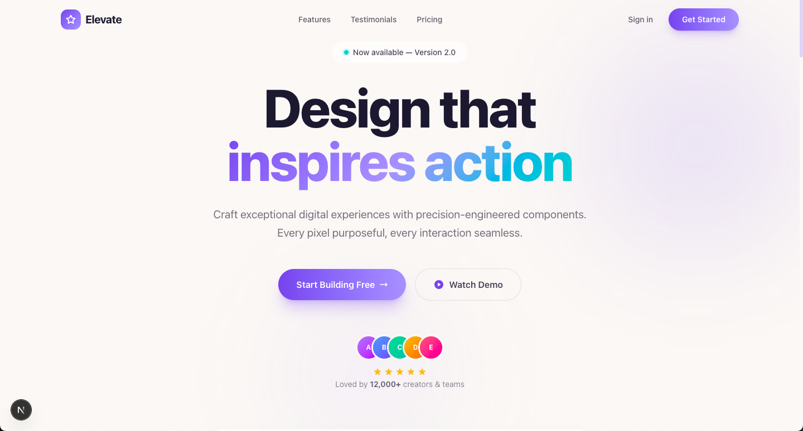
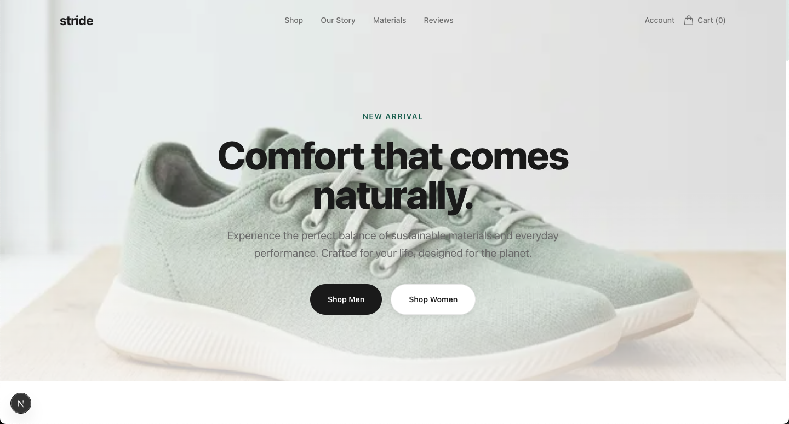
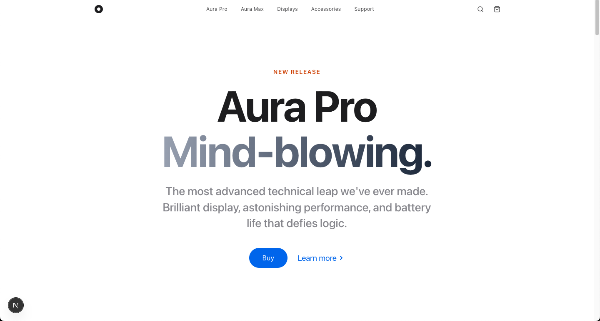

# Premium Web Designs Collection

This repository contains a collection of four distinct, highly polished premium web designs built with Next.js, Tailwind CSS, and Framer Motion. 

Each design features a completely different aesthetic targeted at specific high-end industries.

## The Designs

### 1. [Design 1](./Design1): FinTech SaaS Landing Page
A hyper-modern, neon-accented light theme with futuristic glassmorphism aesthetics ideal for SaaS platforms.

**Live Demo:** [https://web-designs-sigma.vercel.app/](https://web-designs-sigma.vercel.app/)

---

### 2. [Design 2](./Design2): High-End Architecture Portfolio
A brutalist luxury layout featuring edge-to-edge cinematic project galleries and heavy, confident monochromatic typography.

**Live Demo:** [https://web-designs-85j3.vercel.app/](https://web-designs-85j3.vercel.app/)

---

### 3. [Design 3](./Design3): Premium Tech Product (Apple-inspired)
An ultra-minimalist, pristine white/gray landing page designed to showcase high-end consumer hardware with massive whitespace and clean technical grids.

**Live Demo:** [https://web-design-apple.vercel.app/](https://web-design-apple.vercel.app/)

---
